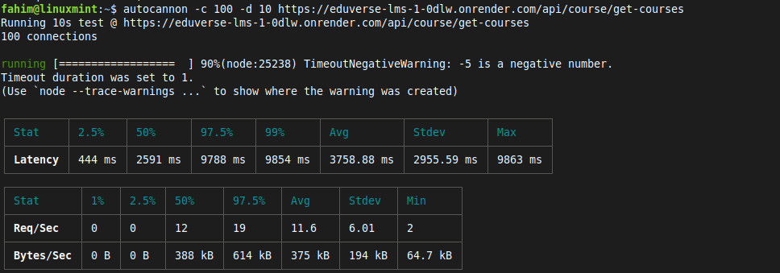
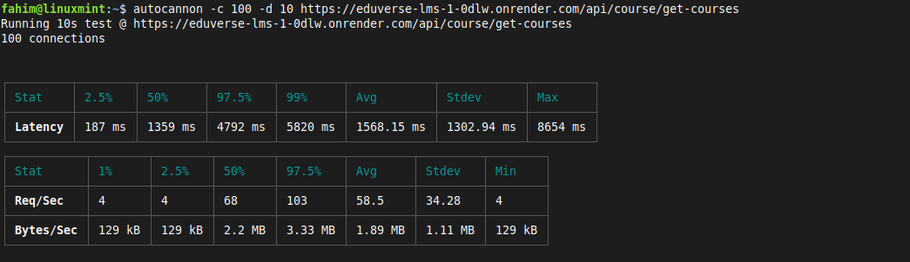
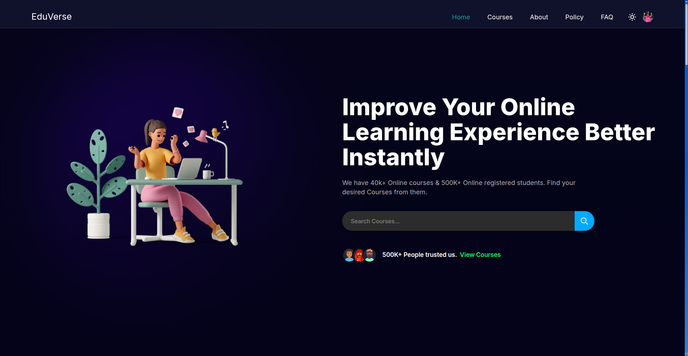
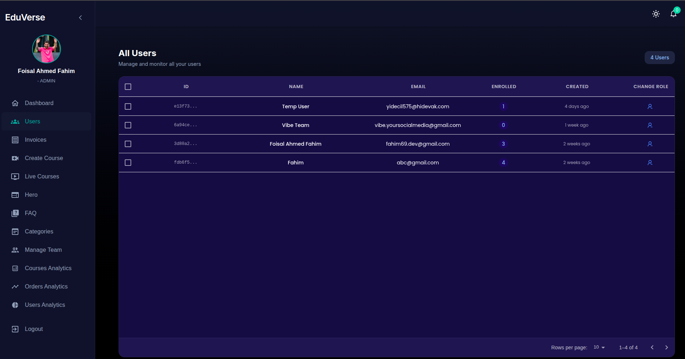

# Eduverse LMS

A full-stack Learning Management System built with the MERN stack, featuring real-time notifications, payment integration, and Redis-optimized performance.

---

## 🎯 Overview

Eduverse is a production-ready LMS where students can browse courses, make purchases via Stripe, track progress, and receive real-time notifications. Admins manage courses, users, and analytics through a dedicated dashboard.

**Tech Stack:** Next.js · TypeScript · Node.js · Express · MongoDB · Redis · Stripe

---

## ✨ Key Features

### For Students
- **Course Catalog** with search and filtering
- **Stripe Payment Integration** for secure purchases
- **Real-time Notifications** via Socket.io
- **Progress Tracking** across enrolled courses
- **Social Authentication** (Google, GitHub) + Email OTP

### For Admins
- **Course Management** — create, edit, publish courses
- **User Management** — view and manage student accounts
- **Analytics Dashboard** — enrollment stats, revenue tracking
- **Content Upload** — video/PDF hosting via Cloudinary

### Technical Highlights
- **Redis Caching** for 5x faster API responses
- **JWT Authentication** with access/refresh token rotation
- **Rate Limiting** to prevent API abuse
- **Responsive UI** with Material-UI components
- **TypeScript** for type safety across the stack

---

## 📊 Performance Optimization

### Problem
The `GET /api/course/get-courses` endpoint was responding slowly under concurrent load, averaging **3.7 seconds** per request.

### Solution
Implemented **Redis caching** with a 5-minute TTL for course listings, dramatically reducing database queries.

### Results
Load tested with [autocannon](https://github.com/mcollina/autocannon) (100 concurrent connections, 10 seconds):

| Metric | Before Redis | After Redis | Improvement |
|--------|--------------|-------------|-------------|
| **Avg Latency** | 3758 ms | **1568 ms** | **58% faster** |
| **Max Latency** | 9863 ms | 3500 ms | **64% reduction** |
| **Throughput** | 11.6 req/s | **58.5 req/s** | **5x increase** |

📸 View Benchmark Screenshots

**Before Redis:**

**After Redis:**

---

## 🖼️ Screenshots

<table>
  <tr>
    <td></td>
    <td></td>
  </tr>
  <tr>
    <td align="center"><b>Student Home Page</b></td>
    <td align="center"><b>Admin Dashboard</b></td>
  </tr>
</table>

---

## 🛠️ Tech Stack

**Frontend**
- Next.js 14 (App Router)
- TypeScript
- Redux Toolkit + RTK Query
- Material-UI (MUI)
- Socket.io-client

**Backend**
- Node.js + Express
- MongoDB + Mongoose
- Redis (caching)
- Socket.io (real-time)
- Stripe (payments)
- Cloudinary (media storage)
- Nodemailer (email)

**Security**
- Implementing **JWT-based authentication** where short-lived access tokens (5min) are paired with long-lived refresh tokens (7 days), automatically rotating to maintain security without requiring frequent re-login
- Express rate limiting
- Input validation

---

---

## 🎓 What I Learned

- Implementing **Redis caching** to optimize database-heavy endpoints
- Load testing with **autocannon** to identify bottlenecks
- Integrating **Stripe** for secure payment processing
- Building **real-time features** with Socket.io
- Managing **JWT authentication** with token rotation
- Deploying a full-stack app with separate frontend/backend hosting

---

## 📈 Future Improvements

- [ ] Add video streaming with HLS
- [ ] Implement course reviews and ratings
- [ ] Add certificate generation on course completion
- [ ] Build mobile app with React Native
- [ ] Add analytics dashboard for students

---

## 👤 Author

**Foisal Ahmed Fahim**  
- Email: fahimx51@gmail.com

---

**⭐ Star this repo if you found it helpful!**